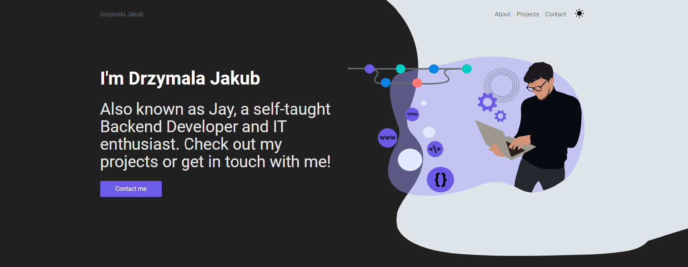

# MY-DEV-SITE

This is my lean but beautiful portfolio site. You can find it on :point_right: <https://www.drzymala.dev/>


<br>

## Theme

I used Gatsby theme made by Smakosh and modified it a bit.
[Gatsby-theme-portfolio](https://github.com/smakosh/gatsby-theme-portfolio)

## Features

- Scores 100% on a11y / Performance / PWA / SEO
- PWA (desktop & mobile)
- Easy to customize
- Nice site structure
- Tablet & mobile friendly
- Amazing illustrations by me and :two_hearts:[LouiseAmelie](https://louiseamelie.github.io/):two_hearts:
- Continuous deployment with [Vercel](https://vercel.com/?utm_source=smakosh)
- A contact form protected by Google Recaptcha
- Functional components with ~~Recompose~~ React Hooks! ~~ready to migrate to React hooks!~~
- Shows my :computer:Github:computer: pinned projects with most stars
- Minimal but sufficient: :file_folder: projects / :man: about me / :mailbox_with_mail: contact me

## Design

Project was created using palette of colors from [flatuicolors.com](https://flatuicolors.com/palette/us)

## Structure

```bash
.
├── data
│   └── config              # SEO related tags
├── src
│   └── assets              # Assets
│   │   │── icons             # icons
│   │   │── illustrations     # illustrations from (undraw.co)
│   │   └── thumbnail         # cover of your website when it's shared to social media
│   ├── components          # Components
│   │   │── common            # Common components
│   │   │── landing           # Components used on the landing page
│   │   └── theme             # Header & Footer
│   └── pages               # Pages
└── static                  # favicon & Netlify redirects
```

## Prerequisites

None really, apart from web browser. Just go to the website, duh ... :octocat:

## Built with

- Adobe XD
- Gatsby
- React & GraphQL
- Formik
- Google recaptcha
- VSCode
- And these useful of JavaScript libraries & Gatsby plugins [package.json](package.json)

## License

The theme this project was build upon is licensed under the MIT License - see the [LICENSE.md](LICENSE.md) file for more details

## Support

If you love this website template and want to support me, you can do so through my GitHub profile. :feelsgood:

## Links

* [Gatsby site](https://www.gatsbyjs.com/)
* [Theme site](https://www.gatsbyjs.com/starters/smakosh/gatsby-portfolio-dev)
